<h1> Rapid deployment of the CoAI on Alibaba Cloud compute nest </h1>

<blockquote>
    
<strong> Disclaimer </strong>: This service is provided by a third party. We try our best to ensure its security,
        accuracy and reliability, but we cannot guarantee that it is completely free from failure, interruption, error
        or attack. Therefore, the company hereby declares that it makes no representations, warranties or commitments
        regarding the content, accuracy, completeness, reliability, suitability and timeliness of the Service and is not
        liable for any direct or indirect loss or damage arising from your use of the Service; for third-party websites,
        applications, products and services that you access through the Service, do not assume any responsibility for
        its content, accuracy, completeness, reliability, applicability and timeliness, and you shall bear the risks and
        responsibilities of the consequences of use; for any loss or damage arising from your use of this service,
        including but not limited to direct loss, indirect loss, loss of profits, loss of goodwill, loss of data or
        other economic losses, even if we have been advised in advance of the possibility of such loss or damage; we
        reserve the right to amend this statement from time to time, so please check this statement regularly before
        using the Service. If you have any questions or concerns about this Statement or the Service, please contact us.
    

</blockquote>

<h2> Overview </h2>

Waline A simple and secure comment system.

    GitHub address of this project: <a href='https://github.com/zmh-program/chatnio/blob/main/README_zh-CN.md'>https://github.com/zmh-program/chatnio/blob/main/README_zh-CN.md</a>

<h2> Prerequisites </h2>

 To deploy a CoAI community edition service instance, you need to
    access and create some Alibaba Cloud resources. Therefore, your account must contain permissions for the following
    resources.  <strong>
    Description </strong>: 51);">: this permission is required only when your account is a RAM account. 

<table>
<thead>
<tr>
<th> Permission policy name </th>
    <th> Remarks </th>
    </tr>
    </thead>
    <tbody>
    <tr>
        <td>AliyunECSFullAccess</td>
        <td> Permissions to manage ECS </td>
    </tr>
    <tr>
        <td>AliyunVPCFullAccess</td>
        <td> Permissions to manage a VPC </td>
    </tr>
    <tr>
        <td>AliyunROSFullAccess</td>
        <td> Manage permissions for the Resource Orchestration Service
            (ROS) </td>
    </tr>
    <tr>
        <td>AliyunComputeNestUserFullAccess</td>
        <td> Manage user-side permissions for the compute nest service
            (ComputeNest) </td>
    </tr>
    </tbody>
    </table>

<h2> Billing instructions </h2>

 The cost of CoAI deployment in computing nest
    mainly involves:

<ul>
    <li> selected vCPU and memory specifications </li>
    <li> System disk type and capacity </li>
    <li> Internet bandwidth </li>
</ul>

 This service requires ECS instance can access CoAI server from public network. 

<h2> Deployment Architecture </h2>

 This service is deployed on a single ECS instance. The architecture is as follows:

<h2> Parameter description </h2>

<table>
    <thead>
    <tr>
        <th> parameter group </th>
        <th> parameter items </th>
        <th> Description </th>
    </tr>
    </thead>
    <tbody>
    <tr>
        <td> Service instance </td>
        <td> Service instance name </td>
        <td> No more than 64 characters in length, must start with an English
            letter, and can contain numbers, English letters, dashes (-), and underscores (_)</td>
    </tr>
    <tr>
        <td></td>
        <td> Region </td>
        <td> Region where the service instance is deployed </td>
    </tr>
    <tr>
        <td></td>
        <td> Payment type </td>
        <td> Resource billing type: Pay-As-You-Go and Subscription </td>
    </tr>
    <tr>
        <td> ECS instance configuration </td>
        <td> instance type </td>
        <td> Instance specifications available in the Availability Zone 
        </td>
    </tr>
    <tr>
        <td></td>
        <td> Instance password </td>
        <td> is 8-30 in length and must contain three items (uppercase letters,
            lowercase letters, numbers, ()'~! @#$%^& *-+ ={}[]:;,.? Special symbols in)</td>
    </tr>
    <tr>
        <td> Availability Zone configuration </td>
        <td> Availability Zone </td>
        <td> Zone where the ECS instance is located </td>
    </tr>
    <tr>
        <td> Select an existing / create a new Virtual Private Cloud (VPC) </td>
        <td> ZChoose whether to create a new VPC (Virtual Private Cloud) </td>
    </tr>
    <tr>
        <td>Basic resource configuration</td>
        <td> Private network IPv4 subnet </td>
        <td> The VPC where the new resource is located. </td>
    </tr>
    <tr>
        <td></td>
        <td> Switch subnet segment </td>
        <td> The switch where the newly created resource is located. </td>
    </tr>
    <tr>
        <td>Basic resource configuration</td>
        <td>VPC ID</td>
        <td> VPC where the resource is located </td>
    </tr>
    <tr>
        <td></td>
        <td> Switch ID</td>
        <td> Switch where the resource is located </td>
    </tr>
    </tbody>
</table>

<h2> Deployment process </h2>

<ol>
    <li> visit the compute nest CoAI<a
            href="https://computenest.console.aliyun.com/service/instance/create/ap-southeast-1?type=user&ServiceName=CoAI Community Edition">
        deployment link </a> and fill in the deployment parameters as prompted
    </li>
    <li> Select payment type
        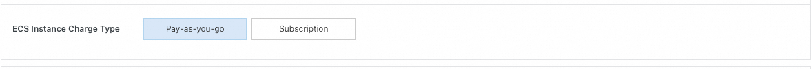</li>
    <li> Enter instance parameters
        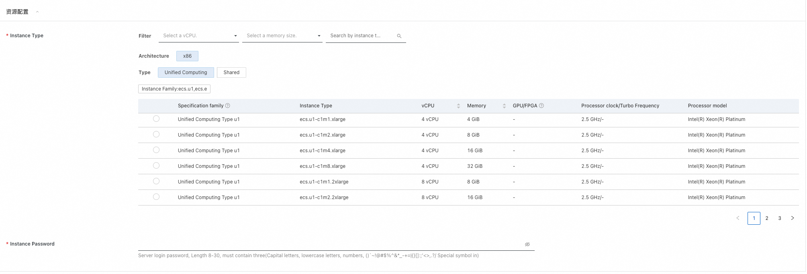</li>
    <li> Fill in the zone and network parameters and click Next: Confirm Order 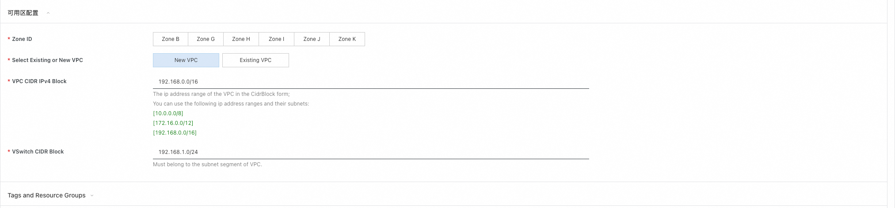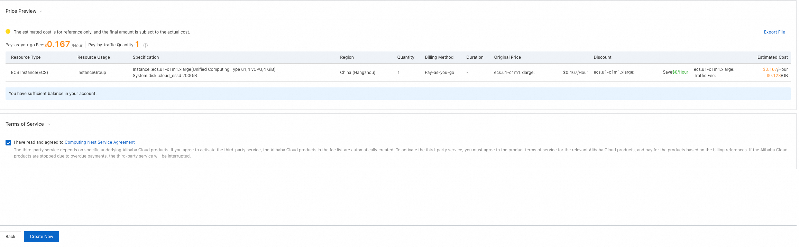</li>
    <li> Confirm all parameters and estimate price, click Create Now and wait for the service instance deployment to complete</li>
    <li> After the service instance is deployed, click the instance ID to go to the details page and click: 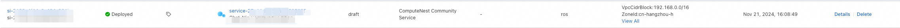
    </li>
    <li> Click on the root avatar in the bottom left corner, then click on the backend management. Here you can perform various configurations, as well as manage customer dashboards, account management, notifications, model marketplace, and more. 
        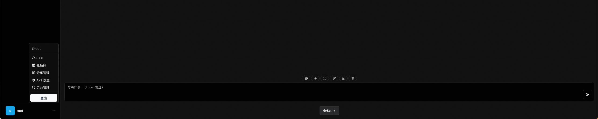 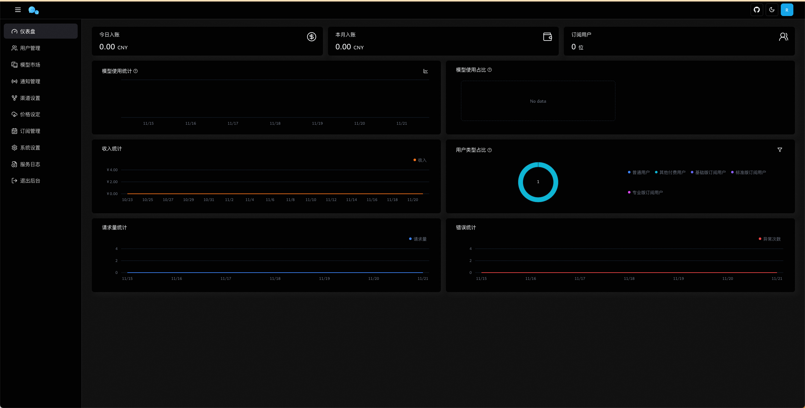
    </li>
    <li> Click on "Model Market," then click on "Add New Model." Enter "qwen-turbo" for the model ID, click "Submit," and then click "Save" in the upper right corner.
        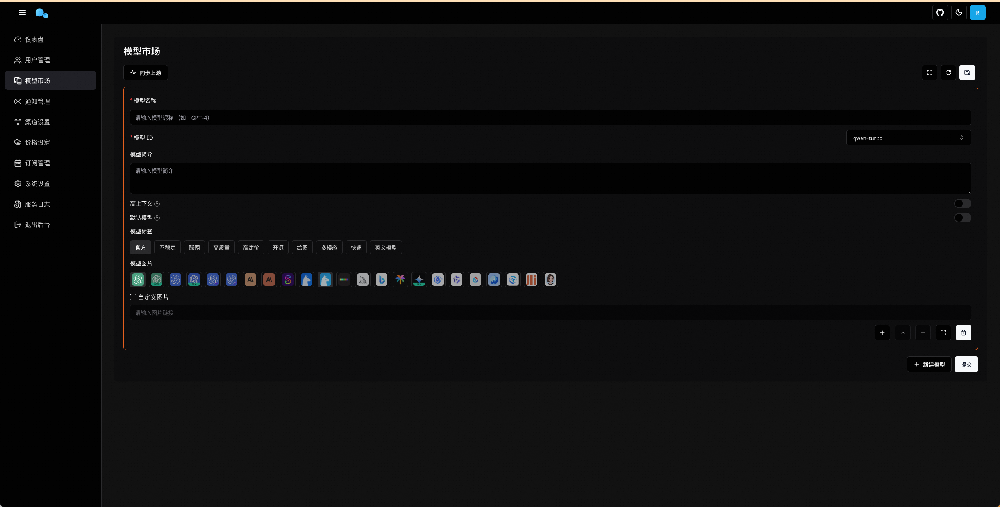
    </li>
    <li> Click on Channel Settings, enter the name, select "通义千问 TongYi" as the type, click Add Model, select "qwen-turbo", and enter the secret key for accessing 通义千问 TongYi. You can refer to: 
        <a href="https://www.alibabacloud.com/help/en/model-studio/developer-reference/get-api-key">Obtain an API key</a>for instructions on how to obtain the secret key. The API Key in the "Account Settings" section of the document is the secret key. Click Confirm.
        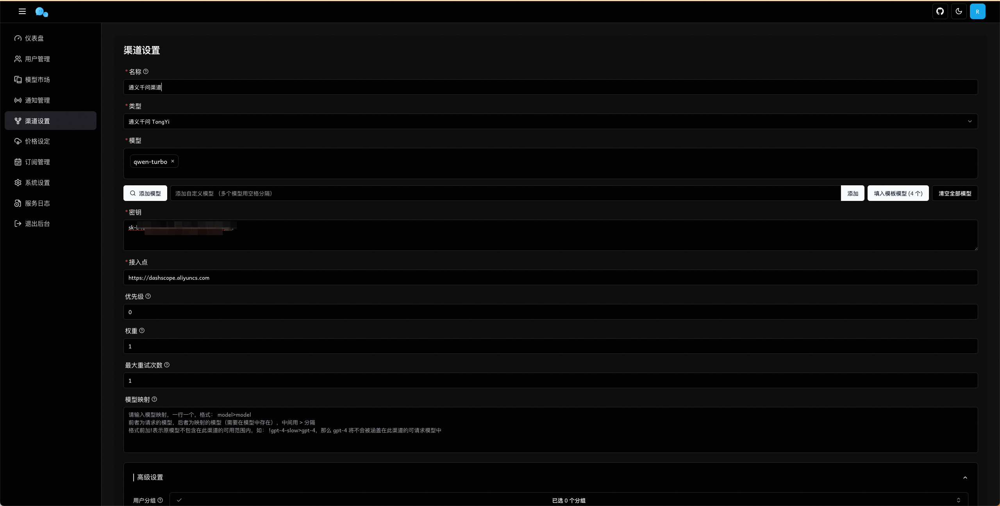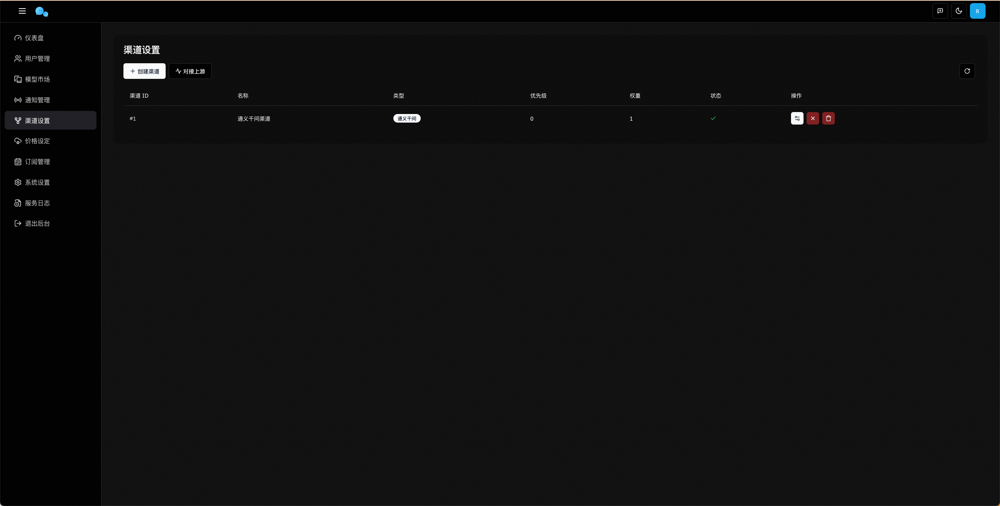
    </li>
    <li> At this point, you have successfully configured the CoAI Community Edition and can start using it! You can refresh the page and click to exit the backend to test the integration status of the large model. You can also share your CoAI address with others for them to register an account and log in to use it. Additionally, you can charge and manage the usage of others. Feel free to explore more features!
        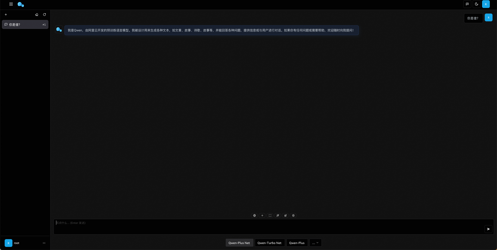
    </li>
</ol>