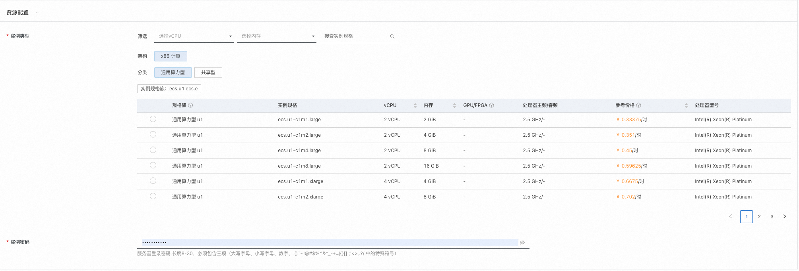
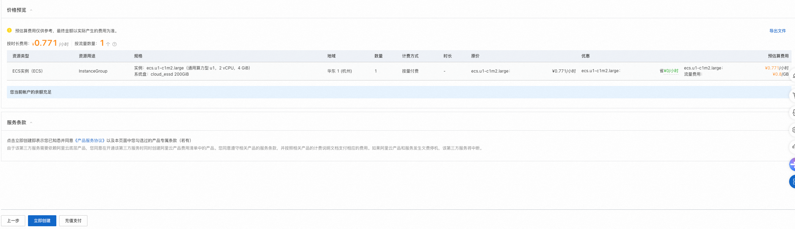
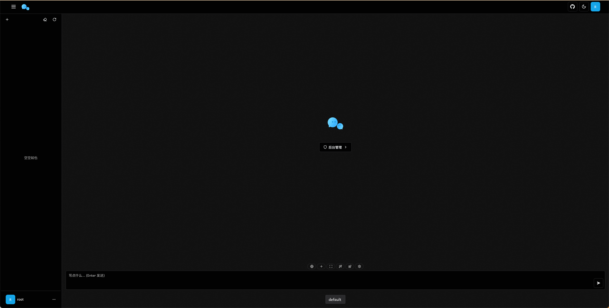

# Chat-Nio计算巢快速部署

>**免责声明**：本服务由第三方提供，我们尽力确保其安全性、准确性和可靠性，但无法保证其完全免于故障、中断、错误或攻击。因此，本公司在此声明：对于本服务的内容、准确性、完整性、可靠性、适用性以及及时性不作任何陈述、保证或承诺，不对您使用本服务所产生的任何直接或间接的损失或损害承担任何责任；对于您通过本服务访问的第三方网站、应用程序、产品和服务，不对其内容、准确性、完整性、可靠性、适用性以及及时性承担任何责任，您应自行承担使用后果产生的风险和责任；对于因您使用本服务而产生的任何损失、损害，包括但不限于直接损失、间接损失、利润损失、商誉损失、数据损失或其他经济损失，不承担任何责任，即使本公司事先已被告知可能存在此类损失或损害的可能性；我们保留不时修改本声明的权利，因此请您在使用本服务前定期检查本声明。如果您对本声明或本服务存在任何问题或疑问，请联系我们。

## 概述
Chat-Nio帮您两步在云端部署你的开源聊天机器人！
此项目的GitHub地址：[https://github.com/coaidev/coai/tree/main](https://github.com/coaidev/coai/tree/main)

## 前提条件
部署Chat-Nio社区版服务实例，需要对部分阿里云资源进行访问和创建操作。因此您的账号需要包含如下资源的权限。 **说明**：当您的账号是RAM账号时，才需要添加此权限。

| 权限策略名称 | 备注 |
| --- | --- |
| AliyunECSFullAccess | 管理云服务器服务（ECS）的权限 |
| AliyunVPCFullAccess | 管理专有网络（VPC）的权限 |
| AliyunROSFullAccess | 管理资源编排服务（ROS）的权限 |
| AliyunComputeNestUserFullAccess | 管理计算巢服务（ComputeNest）的用户侧权限 |

## 计费说明
ChatGPT-on-WeChat社区版在计算巢部署的费用主要涉及：

+ 所选vCPU与内存规格
+ 系统盘类型及容量
+ 公网带宽

## 部署架构
本服务部署在单台ECS实例上，架构如下：

## 参数说明
| 参数组 | 参数项 | 说明                                            |
| --- | --- |-------------------------------------------------------------------------------------------|
| 服务实例 | 服务实例名称 | 长度不超过64个字符，必须以英文字母开头，可包含数字、英文字母、短划线（-）和下划线（_） |
| | 地域 | 服务实例部署的地域                                     |
| | 付费类型 | 资源的计费类型：按量付费和包年包月                             |
| 资源配置 | 实例类型 | 可用区下可以使用的实例规格                                 |
| | 实例密码 | 长度8-30，必须包含三项（大写字母、小写字母、数字、 ()`~!@#$%^&*-+=          |{}[]:;'<>,.?/ 中的特殊符号） |
| 可用区配置 | 可用区 | ECS实例所在可用区                                    |
| | 选择已有/新建的专有网络 | 选择是否新建专有网络                                    |
| | 专有网络IPv4网段 | 新建资源所在VPC                                     |
| | 交换机子网网段 | 新建资源所在交换机                                       |
| | VPC ID | 资源所在VPC                                       |
| | 交换机ID | 资源所在交换机                                       |

## 部署流程
1. 访问计算巢Chat-Nio[部署链接](https://computenest.console.aliyun.com/service/instance/create/default?type=user&ServiceName=Chat-Nio社区版)，按提示填写部署参数
2. 选择付费类型 
3. 填写实例参数 
4. 填写可用区和网络参数
5. 点击“下一步：确认订单”
6. 确认部署参数并查看预估价格后，点击立即创建，等待服务实例部署完成
7. 服务实例部署完成后，点击实例ID进入到详情界面
8. 点击“立即使用”中的chatnio_address，可进入Chat-Nio社区版界面，点击登录。默认用户名为root，密码为chatnio123456
9. 点击左下角root头像，点击后台管理。此处可以进行各项配置，以及客户看板、账号管理、通知、模型市场等等

10. 点击模型市场，点击新增模型，模型ID输入qwen-turbo，点击提交，并点击右上角保存
11. 点击渠道设置，输入名称，类型选择"通义千问 TongYi"，点击添加模型，选择"qwen-turbo"，并输入接入通义千问的秘钥，秘钥获取方式可参考：[账号设置](https://help.aliyun.com/zh/model-studio/getting-started/first-api-call-to-qwen)。文中"账号设置"小节中的API Key即为秘钥。点击确认。

12. 至此，您已经配置好Chat-Nio社区版，可以开始使用啦！您可以刷新页面并点击退出后台，测试大模型接入情况。也可以将您的Chat-Nio地址分享给他人注册账号，登录使用。同时，您可以针他人用量进行收费、管理等操作。更多用法，欢迎探索！
